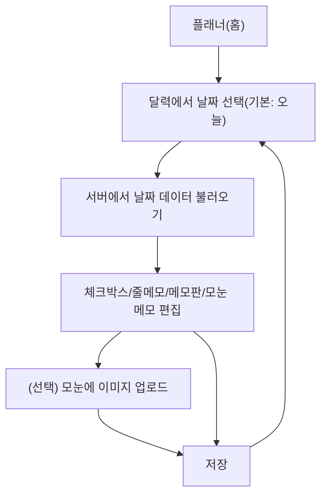

## 1. Product Overview
달력에서 날짜(기본: 오늘)를 선택하고, 해당 날짜의 메모들을 저장/불러오기 할 수 있는 데일리 플래너입니다.
체크박스·줄메모·메모판·모눈 메모를 한 화면에서 관리하고, 모눈 메모에는 이미지를 업로드해 첨부합니다.

## 2. Core Features

### 2.1 Feature Module
1. **플래너(홈) 페이지**: 달력 날짜 선택(기본 오늘), 날짜별 저장/불러오기, 체크박스, 줄메모, 메모판, 모눈 메모(이미지 업로드 포함).

### 2.3 Page Details
| Page Name | Module Name | Feature description |
|---|---|---|
| 플래너(홈) | 날짜 선택(달력) | 오늘 날짜를 기본으로 선택해 표시하고, 다른 날짜 클릭 시 선택 상태를 변경. |
| 플래너(홈) | 날짜별 불러오기 | 선택된 날짜의 저장 데이터를 서버에서 조회해 화면에 반영. |
| 플래너(홈) | 날짜별 저장 | 선택된 날짜의 현재 입력 상태(체크박스/줄메모/메모판/모눈)를 서버에 저장. |
| 플래너(홈) | 체크박스 | 항목 추가/삭제, 체크/해제, 순서 변경을 통해 할 일 목록을 관리. |
| 플래너(홈) | 줄메모 | 여러 줄 텍스트를 작성/수정/삭제하여 간단 메모를 기록. |
| 플래너(홈) | 메모판 | 자유 형식 텍스트를 작성/수정하여 긴 메모를 기록. |
| 플래너(홈) | 모눈 메모 | 격자 형태 캔버스(또는 셀 그리드)에서 스티키/텍스트 블록을 배치·수정·삭제. |
| 플래너(홈) | 모눈 이미지 업로드 | 이미지를 업로드하고, 업로드 결과(미리보기/첨부)를 모눈 메모에 배치. |

## 3. Core Process
- 기본 진입 흐름: 플래너에 접속하면 오늘 날짜가 자동 선택되고 해당 날짜 데이터가 불러와집니다. 사용자는 체크박스/줄메모/메모판/모눈 메모를 편집한 뒤 저장합니다.
- 날짜 전환 흐름: 사용자가 달력에서 다른 날짜를 클릭하면 해당 날짜로 전환되고 서버에서 데이터를 불러옵니다. 필요 시 편집 후 저장합니다.
- 이미지 첨부 흐름: 사용자가 모눈 메모에서 이미지 업로드를 실행하면 파일을 서버로 업로드하고, 반환된 이미지 참조를 모눈 메모에 첨부/배치한 뒤 저장합니다.

