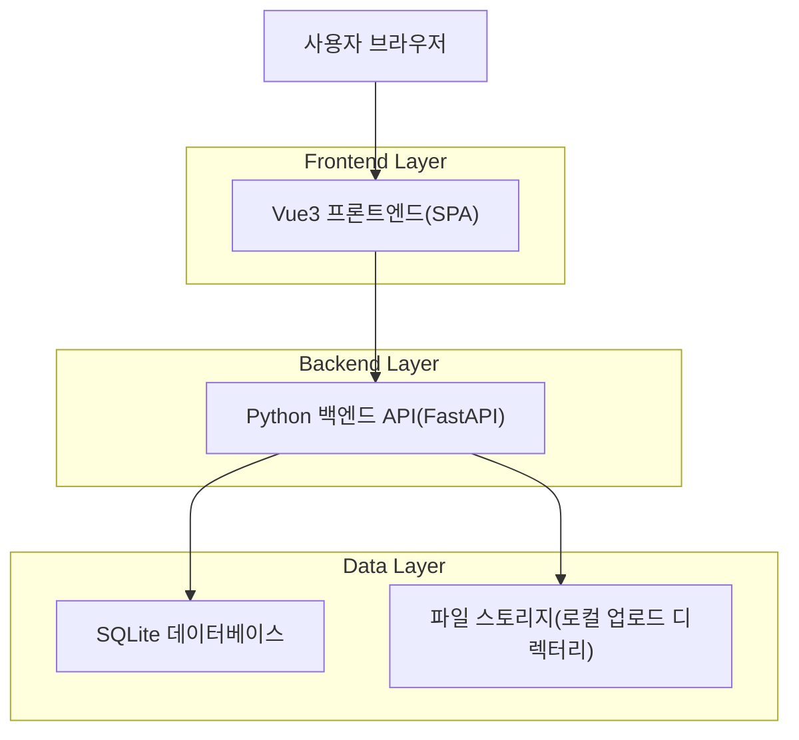
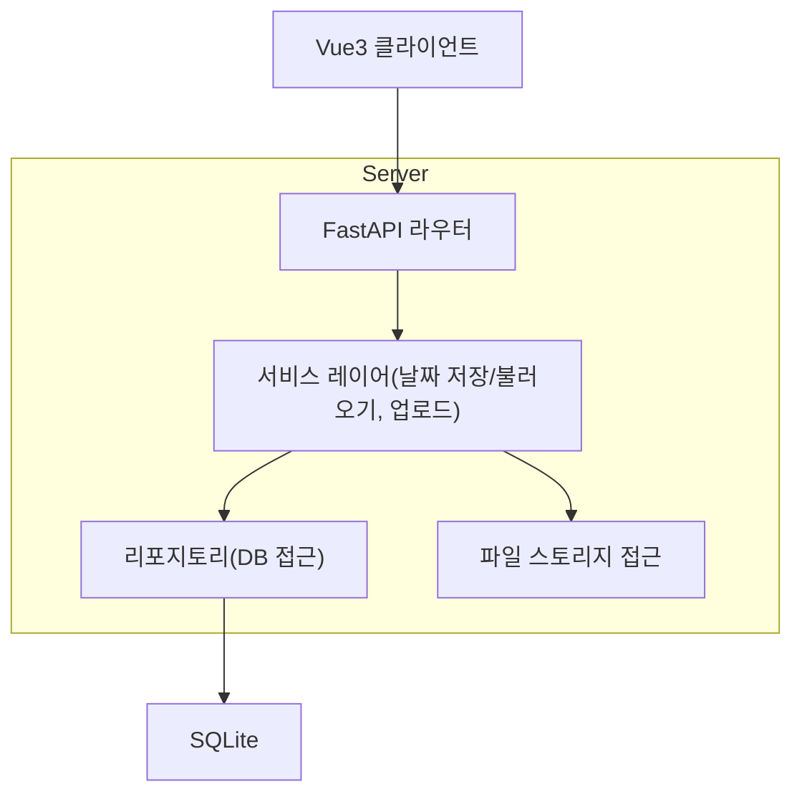
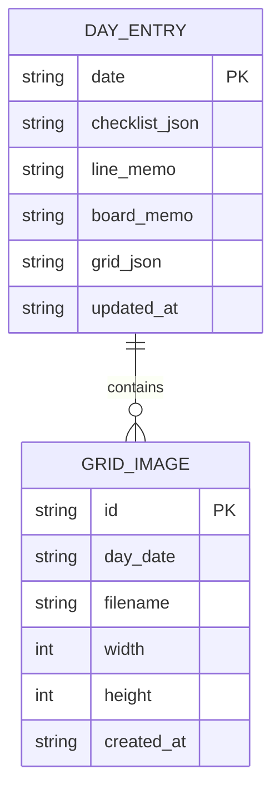

## 1.Architecture design


## 2.Technology Description
- Frontend: Vue@3 + vite + vue-router + pinia (상태관리)
- Backend: Python@3.11 + FastAPI + Uvicorn
- Database: SQLite
- File Upload: FastAPI multipart 업로드 + 서버 로컬 파일 저장(정적 서빙)

## 3.Route definitions
| Route | Purpose |
|---|---|
| / | 플래너 메인 화면(달력, 날짜별 메모 편집/저장/불러오기, 이미지 업로드) |

## 4.API definitions (If it includes backend services)

### 공통 타입(프론트/백엔드 공용 개념)
```ts
export type ISODate = string; // 예: "2026-02-01"

export type ChecklistItem = {
  id: string;
  text: string;
  checked: boolean;
  order: number;
};

export type GridImage = {
  id: string;
  url: string;
  width: number;
  height: number;
};

export type GridBlock = {
  id: string;
  x: number;
  y: number;
  w: number;
  h: number;
  type: "text" | "image";
  text?: string;
  image?: GridImage;
};

export type DayPayload = {
  date: ISODate;
  checklist: ChecklistItem[];
  lineMemo: string;   // 줄메모
  boardMemo: string;  // 메모판
  grid: {
    cols: number;
    rows: number;
    blocks: GridBlock[];
  };
  updatedAt: string; // ISO datetime
};
```

### 4.1 Core API
#### 날짜별 불러오기
```
GET /api/days/{date}
```
- Path: date(ISODate)
- Response: `DayPayload` (없으면 빈 기본 구조 반환)

#### 날짜별 저장
```
PUT /api/days/{date}
```
- Path: date(ISODate)
- Body: `DayPayload` (date는 path와 일치)
- Response: `{ ok: true, updatedAt: string }`

#### 모눈 이미지 업로드
```
POST /api/uploads/images
```
- Body: `multipart/form-data` (file)
- Response: `GridImage`

#### 업로드 파일 서빙
```
GET /uploads/{filename}
```
- Response: image binary

## 5.Server architecture diagram (If it includes backend services)


## 6.Data model(if applicable)

### 6.1 Data model definition


### 6.2 Data Definition Language
Day Table (day_entries)
```
CREATE TABLE IF NOT EXISTS day_entries (
  date TEXT PRIMARY KEY,
  checklist_json TEXT NOT NULL DEFAULT '[]',
  line_memo TEXT NOT NULL DEFAULT '',
  board_memo TEXT NOT NULL DEFAULT '',
  grid_json TEXT NOT NULL DEFAULT '{"cols":24,"rows":24,"blocks":[]}',
  updated_at TEXT NOT NULL
);
```

Grid Image Table (grid_images)
```
CREATE TABLE IF NOT EXISTS grid_images (
  id TEXT PRIMARY KEY,
  day_date TEXT NOT NULL,
  filename TEXT NOT NULL,
  width INTEGER NOT NULL,
  height INTEGER NOT NULL,
  created_at TEXT NOT NULL
);

CREATE INDEX IF NOT EXISTS idx_grid_images_day_date ON grid_images(day_date);
```
